#   Heart Disease Prediction Project

A complete Machine Learning project to **predict the presence of heart disease** using the [Kaggle Heart Disease Dataset](https://www.kaggle.com/datasets/fedesoriano/heart-failure-prediction). This project includes **data cleaning, preprocessing, exploratory data analysis, feature selection, modeling, evaluation, and deployment** through a Flask web application.  

---

## **Project Motivation**

Heart disease is one of the leading causes of death globally. Early prediction helps identify high-risk patients and can potentially save lives. This project demonstrates the full workflow from **raw data to a predictive web app**, making it an end-to-end example of a real-world ML project.

---

## **Project Workflow**

1. **Data Exploration & Cleaning**
   - Analyzed missing values and inconsistencies.  
   - Explored feature distributions and relationships.  
   - Encoded categorical features and scaled numeric features.  
   - Notebooks: [Heart Cleaning & EDA](notebooks/heart-eda-cleaning.ipynb)

2. **Feature Engineering**
   - Used **Random Forest** to determine the most important features.  
   - Created a reduced dataset with only the top predictive features.

3. **Modeling**
   - Built a **pipeline** with preprocessing + **XGBoost** classifier.  
   - Train/Test Accuracy:
     - Train Accuracy: 86%  
     - Test Accuracy: 84%  
   - Plotted a **correlation heatmap** of processed features.

4. **Visualization**
   - Explored relationships between features and target variable.
   - Generated key plots to gain insights.  
   - Saved visualizations in `screenshots/` folder.

5. **Deployment**
   - Built a **Flask web application** for user input.  
   - Integrated preprocessing and trained model.  
   - Users can input patient data and get a real-time heart disease prediction.  
   - Screenshots and video demonstration included below.

---

## **Repository Structure**
```
heart-disease-project/
│
├─-- dataset/                                         # Original and processed datasets
├─-- notebooks/                                       # Jupyter notebooks for EDA and modeling
├─-- src/                                             # Python scripts for preprocessing, feature selection
├─-- models/                                          # Trained XGBoost model files (pipe.pkl)
├─-- ds_plots/                                        # Plots Images 
├─-- templates/                                       # HTML files
├─-- static/                                          # Image files
├─-- app.py                                           # Flask code
├─-- screenshots/                                     # Screenshots and demo video
├─ requirements.txt                                   # Python dependencies
├─ README.md                                          # Project documentation
└─ .gitignore                                         # Files/folders to ignore in Git 

```


---

## **Visualizations**


### **1. Heart Risk Increase With ST Slope Change**
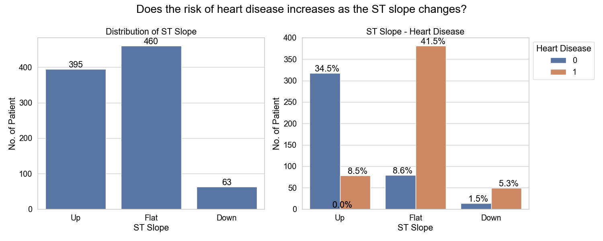 
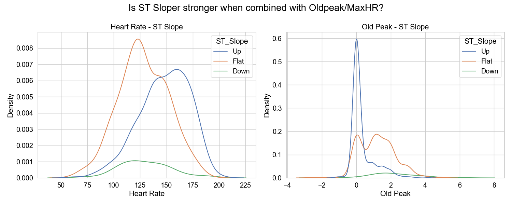 
**ST slope is a strong predictor of heart disease**. Patients with **flat slopes have the highest risk**, followed by **downsloping slopes**. In contrast, **upsloping slopes are the safest, with only small percent of patients affected**.

The graphs also indicates that **exercise-induced ST segment behavior is a critical indicator of cardiac risk**, especially when combined with **other features like Oldpeak and MaxHR**.

### **2. Distribution of Age vs Heart Disease**
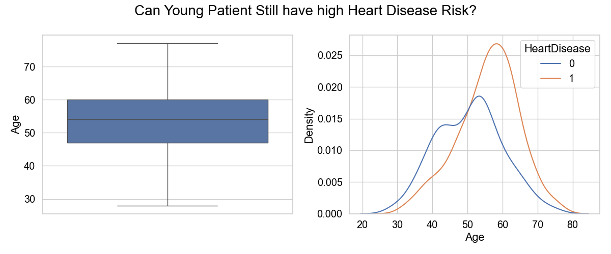 
- The boxplot shows that **most heart disease cases are concentrated in the 45–60 age group**, even though the overall age range in the dataset spans approximately 25 to 75 years.

- This indicates that **middle-aged individuals are at a higher risk** of developing heart disease compared to younger age groups.

- For younger individuals, the KDE plot shows that the **curve for no heart disease (0) is higher than the curve for heart disease (1)**, suggesting that younger people are **less likely to have heart disease**.

- Overall, **age appears to be a significant factor in heart disease occurrence**, with risk increasing notably after the age of 45.


### **3. Cholesterol vs Max Heart Rate**
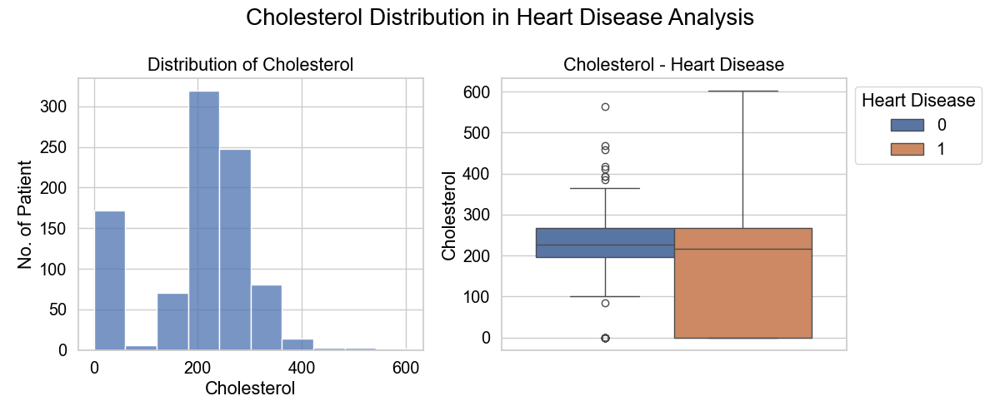
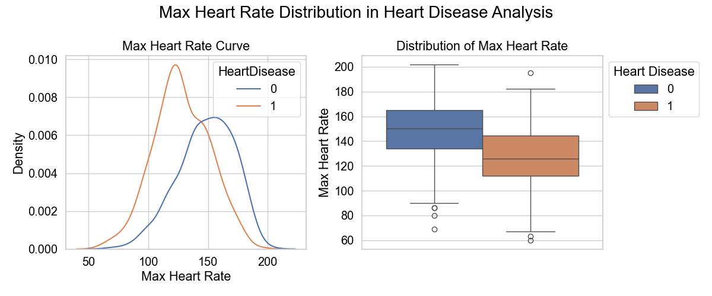
- **Medical Knowledge :** Patients with heart disease often cannot reach high maximum heart rates during exercise due to blocked arteries or heart muscle issues.

  Patients who achieve a **higher maximum heart rate (135–165 bpm) during exercise are more likely to be healthy**,while those with a **lower maximum heart rate (115–145 bpm) have higher chances of heart disease**. This confirms that exercise tolerance (MaxHR) is a **strong predictor of heart health**.


### **4. Feature Importance**
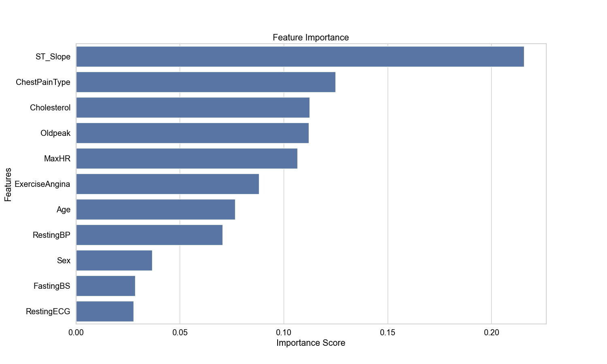


  ### **5. Correlation Heatmap**
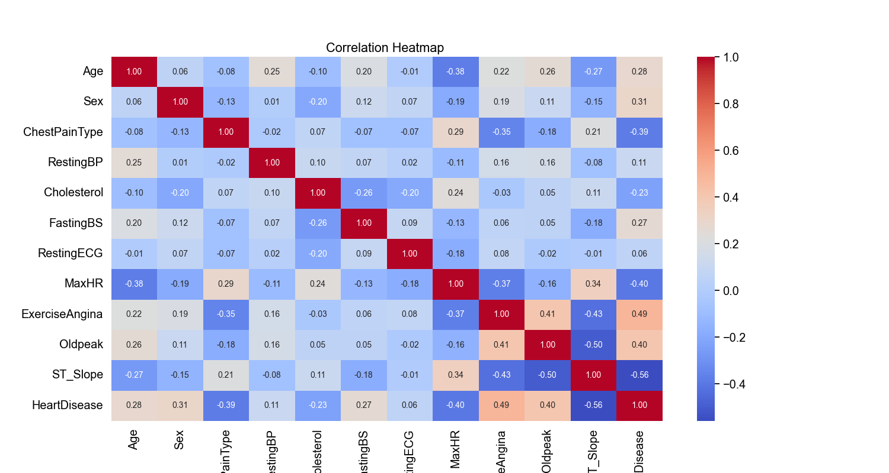


---

## **Web Application Screenshots**

### **Home Page**
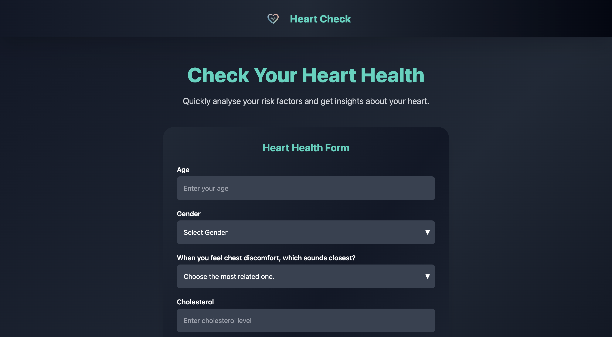
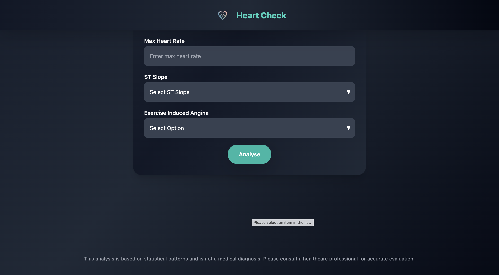

### **User Input Form**
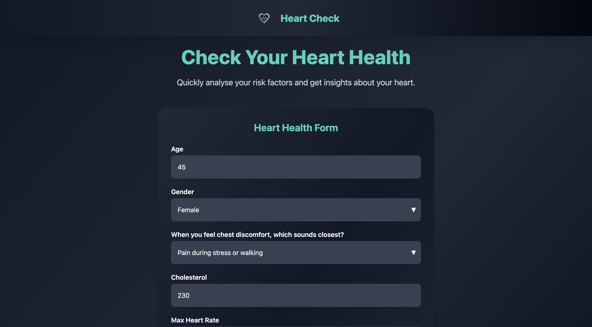
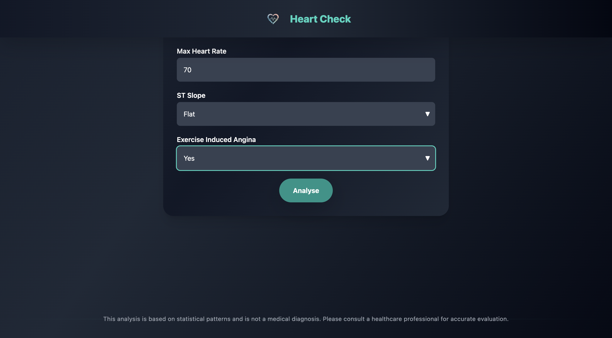

### **Prediction Result**
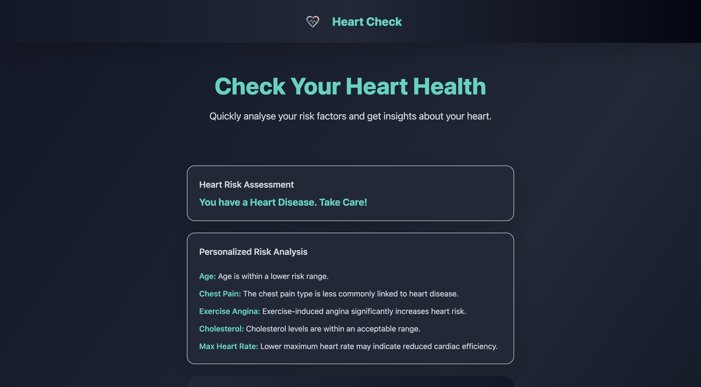

---

## **Video Demonstration**

📹 Demo of the app and workflow:


*(Click the thumbnail to play video or open `screenshots/demo.mp4` locally.)*

---

## **Notebooks & Code**

### **Notebooks**
- [Data Cleaning & EDA](notebooks/heart-eda-cleaning.ipynb)  
- [Feature Selection & Modeling](notebooks/heart-model.ipynb)  

### **Source Code**
- [Flask App](app.py)  
- [HTML Templates](templates/index.html)  
- [CSS / Static Files](static/style.css)  
- Optional scripts (if refactored):
  - [Preprocessing](src/preprocessing.py)
  - [Feature Selection](src/feature_selection.py)
  - [Model Training](src/model_training.py)

### **Models** 
- Preprocessing Trained pipeline: `models/pipe.pkl`

---

## **Installation & Usage**

1. **Clone the repository**
```bash
git clone https://github.com/yourusername/heart-disease-project.git
cd heart-disease-project
